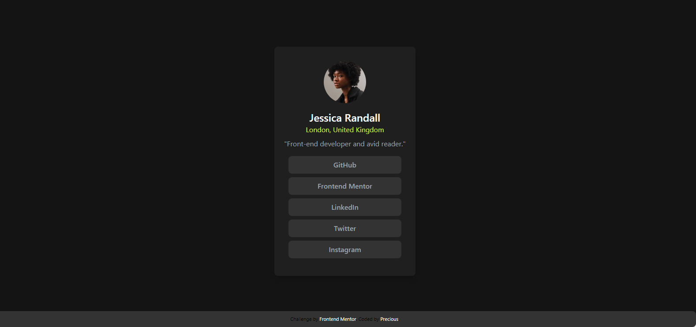

# Frontend Mentor - Social links profile solution

This is a solution to the [Social links profile challenge on Frontend Mentor](https://www.frontendmentor.io/challenges/social-links-profile-UG32l9m6dQ). Frontend Mentor challenges help you improve your coding skills by building realistic projects. 

## Table of contents

- [Overview](#overview)
  - [The challenge](#the-challenge)
  - [Screenshot](#screenshot)
  - [Links](#links)
- [My process](#my-process)
  - [Built with](#built-with)
  - [What I learned](#what-i-learned)
  - [Continued development](#continued-development)
  - [Useful resources](#useful-resources)
- [Author](#author)
- [Acknowledgments](#acknowledgments)

## Overview

### The challenge

Users should be able to:

- See hover and focus states for all interactive elements on the page

### Screenshot

### Links

- Live Site URL: [live site  ](https://ijechidi.github.io/social-links-profile-main/)

## My process

### Built with

- Semantic HTML5 markup
- CSS custom properties
- [tailwindcss](https://tailwindcss.com/docs/utility-first) - Example of styles
- [Styled Components](https://tailwindcss.com/docs/adding-custom-styles#adding-component-classes) - For styling component

### What I learned

##### Utility-First Approach: Tailwind CSS emphasizes using small, single-purpose utility classes to construct UI components directly in  HTML markup
##### Customizable: Tailwind CSS is highly customizable. We can extend and configure the framework to fit the project's needs through a configuration file
##### Responsive Design: Tailwind CSS includes responsive utility classes, enabling easy implementation of responsive designs without additional CSS media queries

### Continued development

Still in the process of knowing of [components](https://tailwindcss.com/docs/adding-custom-styles#adding-component-classes)

### Useful resources

- [Components in tailwind](https://tailwindcss.com/docs/adding-custom-styles#adding-component-classes) - This helped me in developping the card. I really liked this pattern and will use it going forward.
- [Flowbite](https://flowbite.com/) - This is an amazing article which helped me finally understand in details this css framework. I'd recommend it to anyone still learning this concept.

## Author

- Website - [Precious Ogwo](https://www.your-site.com)
- Linkdln - [Precious Ogwo](https://www.linkedin.com/in/precious-ogwo-971118255?utm_source=share&utm_campaign=share_via&utm_content=profile&utm_medium=android_app)

## Acknowledgments

Thanks to coach [Farida](https://github.com/faridah202) i was able to understand more of tailwindcss concept and am hoping for more oppoturnities like this ,
also  [Social links profile challenge on Frontend Mentor](https://www.frontendmentor.io/challenges/social-links-profile-UG32l9m6dQ) made it possible to improve my coding skills

